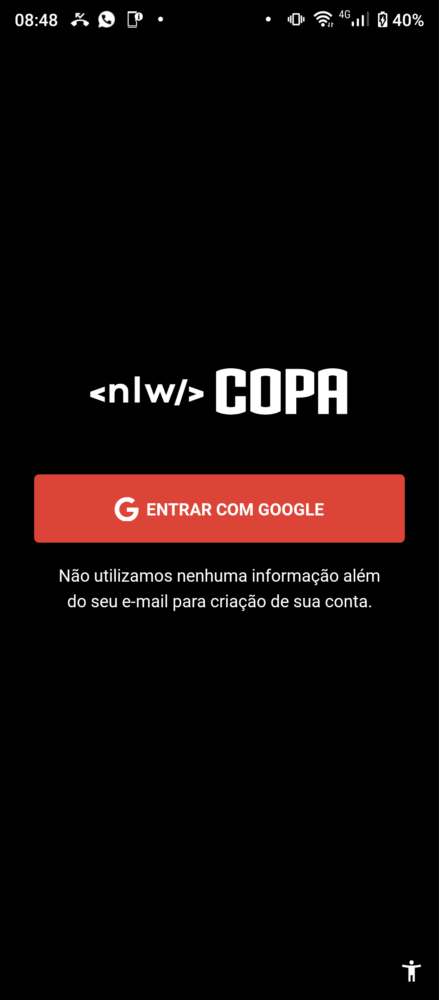
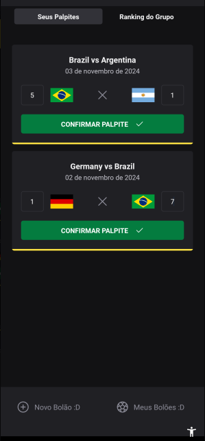

# Bolão da Copa - [APP]

<p align="center"> 
  <a target="_blank" href="https://www.rocketseat.com.br/">
    
  </a> 
</p>

<h4 align="center" >🚀 🟪 Next Level Week - Copa 2022 🟪 🚀</h4>


<h4 align="center">
  Application developed during a Full Stack Event, the <a target="_blank" style="color: #8a4af3;" href="https://github.com/topics/next-level-week">Next Level Week #10</a> promoted by <a target="_blank" style="color: #8a4af3;" href="https://www.rocketseat.com.br/">@Rocketseat</a>
</h4>

#

<br>

<p align="center"></p>


#
<p align="center">
  |&nbsp;&nbsp;
  <a style="color: #8a4af3;" href="#project">Project</a>&nbsp;&nbsp;&nbsp;|&nbsp;&nbsp;&nbsp;
  <a style="color: #8a4af3;" href="#techs">Technologies</a>&nbsp;&nbsp;&nbsp;|&nbsp;&nbsp;&nbsp;
  <a style="color: #8a4af3;" href="#app">App</a>&nbsp;&nbsp;&nbsp;|&nbsp;&nbsp;
  <a style="color: #8a4af3;" href="#run-project">Run</a>&nbsp;&nbsp;&nbsp;|&nbsp;&nbsp;
  <a style="color: #8a4af3;" href="#author">Author</a>&nbsp;&nbsp;&nbsp;|&nbsp;&nbsp;&nbsp;
</p>

#

<h1 align="center">
  
  <a target="_blank" href="https://github.com/Samuel-Ricardo">
    
  </a>

  <a target="_blank" herf="https://www.instagram.com/samuel_ricardo.ex/">
     
  </a>

  <a target="_blank" herf='https://www.linkedin.com/in/samuel-ricardo-cabral/'>
     
  </a>

  <a target="_blank" herf='https://www.linkedin.com/in/samuel-ricardo-cabral/'>
     
  </a>

</h1>

<br>

<p id="project"/>

<h2>  | :artificial_satellite: About:  </h2>



<p align="justfy">
  This app has as a target, allow the users create yours own betting groups and share with her friends. Uses Google Auth and JWT to login, signin and handler users sessions. Create, share and have with the betting groups, good lucky :D
</p>

<p align="justfy">
  The router system is maneged by react-navigator based on bottom-tabs, was created a auth Context with the useContext of React library to manage state and provide for all application data about user and auth. Uses Axios to comunicate with API. For app style was used the native-base that help to much. And was necessary handle the SVG images.   
</p>

#

 - APK: ...
 - Repo: [Front-end] - <a style="color: #8a4af3;" href="https://github.com/Samuel-Ricardo/bolao-da-copa">Bolão Da Copa - [Landing Page]</a>
 - Repo: [API] - <a style="color: #8a4af3;" href="https://github.com/Samuel-Ricardo/bolao-da-copa_api">Bolão Da Copa - [API]</a>
 - Current Version <b> 1.0.0 </b>

#

<h2 id="techs">
  💻 | Technologies:  
</h2>

  > <a href='https://docs.expo.dev/'>  </a>

  <br>

<p> - Google APIs           </p>
<p> - Google Auth           </p>
<p> - Google Fonts          </p>
<p> - JavaScript            </p>  
<p> - TypeScript            </p>
<p> - NodeJS                </p>
<p> - Expo                  </p>
<p> - ReactNative           </p>
<p> - Reac Navigation       </p>
<p> - Native Base           </p>
<p> - Phosphor React Native </p>
<p> - React Hooks           </p>
<p> - Context API           </p>
<p> - eas                   </p>
<p> - vector-icons          </p>
<p> - JWT                   </p>
<p> - Axios                 </p>
<p> - SVG Handlings         </p>
<p> - .env variables        </p>

<br>

> Among Others...

#

<h2 id="app">
 [📱] - Application  
</h2>


<h3>
  | Signin:
</h3>

<div align="center">
  
  
</div>

<p>
  Here you can Signin with a Google Account that is very easy, simple and fast, just essential data are colected like your name or perfil image :)
</p>

<br>

<h3>
  | Create
</h3>

<div align="center">
  
  
  
</div>

<p>
  Here you can create a betting group and share with your friends, have a null check and dont let you to create a gourp without a name.
</p>

<br>


<h3>
  | Search
</h3>

<div align="center">
  
  
</div>

<p>
  You can search the groups that you make part and get in a new group with her code on "Find" screen 
</p>

<h3>
  | Play
</h3>

<div align="center">
  
  
</div>

<p>
  Now You can make your bets and see what happens, good luck! :D
</p>


#
<h2 id="run-project"> 
   👨‍💻 | How to use
</h2>

### Open your Git Terminal and clone this repository

```git
  $ git clone "git@github.com:Samuel-Ricardo/bolao-da-copa_mobile.git"
```

### Make Pull

```git
  $ git pull "git@github.com:Samuel-Ricardo/bolao-da-copa_mobile.git"
```


You need to have `NodeJS` on your machine and a package manager (`npm`, `yarn`, or other...) to interpret the code and install the dependecies.

> <a target="_blank" href="https://nodejs.org/en/">  </a>


```bash
  
  # To install all the dependencies 
  $ yarn  
  $ npm install

  # To run the project
  $ yarn run dev
  $ npm run dev

```

#

<h2 id="autor">
  :octocat: | Author:  
</h2>

> <a target="_blank" href="https://www.linkedin.com/in/samuel-ricardo-cabral/">  <br> <p> <b> - Samuel Ricardo</b> </p></a>

<h1>
  <a herf='https://github.com/Samuel-Ricardo'>
     
  </a>
  
  <a herf='https://www.instagram.com/samuel_ricardo.ex/'>
     
  </a>
  
  <a herf='https://twitter.com/SamuelR84144340'>
     
  </a>
  
   <a herf='https://www.linkedin.com/in/samuel-ricardo-cabral/'>
     
  </a>
</h1>
